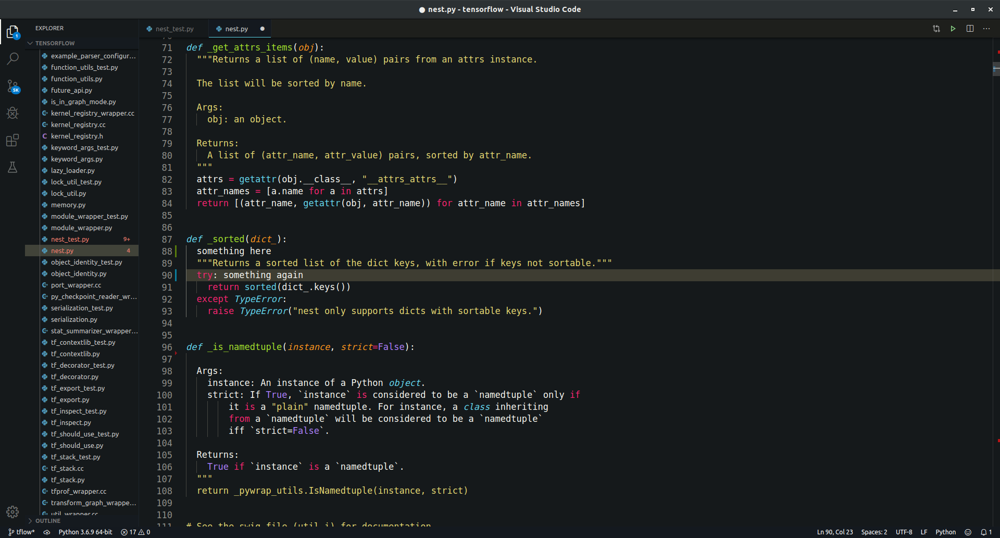

# My visual studio code settings

I made this repo for public use, but typically I save my settings across workstations and platforms using:
[https://marketplace.visualstudio.com/items?itemName=Shan.code-settings-sync](https://marketplace.visualstudio.com/items?itemName=Shan.code-settings-sync)

Git clone my configuration to your new `~/.config/Code/User` :

```
git clone https://github.com/PiyushDatta/User.git ~/.config/Code/User
```

# Dependancies

I have a list of extensions you can download named ```vs_code_extensions_list.txt```, you can then make sure to download this file into ```~/.vscode/extensions``` by doing:

```cat vs_code_extensions_list.txt | xargs -n 1 code --install-extension```

# Other

To get the list of extensions:
  1. ```cd ~/.config/Code/User```
  2. ```code --list-extensions >> vs_code_extensions_list.txt```

# How it looks

with the sidemenus:


without the sidemenus:

